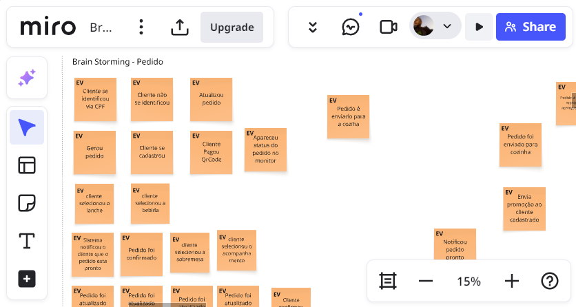

# TechFood

TechFood is a FIAP Post-Graduation project that aims to create a web application for a food delivery service. The project is developed using the dotnet core framework and utilizes the ASP.NET Core MVC architecture. The application is designed to be responsive and user-friendly, providing a seamless experience for both customers and restaurant owner. The project is built with a focus on clean architecture, DDD, and hexagonal architecture principles.

## Project Presentation

[](https://youtu.be/0T7fcPIKPRI)

## Brainstorming

[](https://miro.com/app/board/uXjVIuYTFVc=/)

## Technologies Used

- ASP.NET Core
- Entity Framework Core
- AutoMapper
- SQL Server
- RadixUI
- TypeScript
- HTML/CSS

## Features

- Consumer self-ordering system
- Consumer registration and login
- Restaurant registration and login
- Menu browsing
- Order placement
- Payment integration (Mercado Pago)
- Order painel for consumers
- Admin panel for restaurant owners

### Project Structure

The project is organized into several key components, including:

- **SQL Server**: The database that stores all the application data, including users, restaurants, menus, and orders.
- **API**: The backend API that handles requests and responses, built with ASP.NET Core.
- **Self-Order**: The frontend application that allows consumers to place orders, built with RadixUI and React.
- **Monitor**: A monitoring application for customers to track their orders in real-time.
- **Admin**: An administrative interface for restaurant to manage menu, and order preparation and delivery.
- **NGINX**: The reverse proxy server that routes requests to the appropriate application components.

## Getting Started

To get started with the project, follow these steps:

1. Clone the repository to your local machine.

2. With docker installed in the project root run:

```bash
  docker-compose up -d
```

3. Container http addresses

- api swagger: http://localhost:5000/api/swagger/index.html
- app self-order: http://localhost:5000/self-order/
- app monitor: http://localhost:5000/monitor/
- app admin: http://localhost:5000/admin/

### Credentials

Mercado Pago credentials for payment integration:

- **Seller Username**: `TESTUSER1125814911`
- **Seller Password**: `DD1wLKK8sd`
- **Customer Username**: `TESTUSER1370967485`
- **Customer Password**: `ayGV80NpxL`
- **User ID**: `2414323212`
- **Access Token**: `APP_USR-5808215342931102-042817-5d5fee5e46fe9a6b08d17f29e741091f-2414323212`

Database connection string for the API:

**Connection String**: `Server=techfood.db;Database=dbtechfood;User Id=sa;Password=123456#4EA;TrustServerCertificate=True;`

## Order Flow - Swagger

After starting the application, all the endpoints can be tested using Swagger, which is available at the following URL: [http://localhost:5000/api/swagger/index.html](http://localhost:5000/api/swagger/index.html).

**Creating a new order**:

Do a post to endpoint `/v1/orders`:


Obs: to get the `productId`, you can use the endpoint `/v1/products` to list all products. if there is no products, follow the step - **Creating a new product**

**Creating a new payment**:

After creating an order, you can create a new payment by doing a post to endpoint `/v1/payments`:


You should get as response the QR code to be scanned by the consumer to complete the payment.


After the payment a weebhook will be called to update the order status to PAID and the preparation status to PENDING.

Obs: The weebhook is not implemented yet so you can call directly the endpoint `/v1/payments/{paymentId}`

**Changing preparation status**:

To change the preparation status, you can do a PATCH to the following endpoints:


- `/v1/preparations/{preparationId}/start` to change the status to INPROGRESS.
- `/v1/preparations/{preparationId}/finish` to change the status to DONE.
- `/v1/preparations/{preparationId}/cancel` to change the status to CANCELLED.

After changing the preparation status to DONE you can finish the order and preparation flow doing a PATCH to the endpoint `/v1/orders/{orderId}/finish`.

**Creating a new product**:

In order to create a new product, first you need to create a catergory by doing a post to endpoint `/v1/categories`:


Then, you can create a new product by doing a post to endpoint `/v1/products`:


## Order Flow - Frontend

1. **Consumer**: The consumer uses the self-order application to browse the menu, select items, and place an order. The order is then sent to the restaurant for preparation:


2. **Restaurant**: The restaurant receives the order through the admin panel, where they can manage the menu and track order preparation and delivery:


## Members

- [Elias Soares - RM 362904](https://github.com/eliassoaressouza)
- [Paulo Viana - RM 364330](https://github.com/Phviana)
- [Valdeir Silva - RM 363809](https://github.com/Valdeirsilva2)
- [Leonardo Borges - RM 363195](https://github.com/ldssBorges)
- [Leandro Cervantes - RM 361335](https://github.com/leandrocervant)
